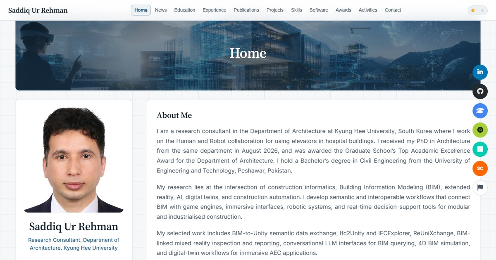

<div align="center">

# 🎓 Academic Portfolio Website

### Saddiq Ur Rehman - PhD Student at Kyung Hee University


[](https://www.linkedin.com/in/saddiq-ur-rehman-b79212138/)
[](mailto:saddiqurrehman@khu.ac.kr)
[](https://github.com/isaddiq)

</div>

---

## 📖 Overview

A modern, responsive academic portfolio website showcasing the research, publications, and professional journey of Saddiq Ur Rehman, a PhD student specializing in Building Information Modeling (BIM) and Artificial Intelligence in the construction industry.

## ✨ Features

- **📱 Responsive Layout & Modern UI**: Built with a clean, responsive layout system using Outfit and Inter typography, CSS custom properties, and fluid grids.
- **🌙 Persistent Dark/Light Mode**: Smooth theme toggler with persistent states stored via browser `localStorage`.
- **📊 Decoupled Data Store**: Fully dynamic content populated via client-side JSON feeds, separating page markup from portfolio data.
- **🚀 Single Page Application (SPA)**: Custom hash-based router (`#home`, `#education`, `#publications`, etc.) with browser history integration (`history.replaceState`) and page metadata/SEO updates.
- **🔍 Advanced Modal System**: Dynamic modals for research projects and award certificates, featuring layout grids, error-resilient image loading, and click-to-zoom overlays.
- **🖼️ Image Zoom Overlay**: Interactive image viewing layer allowing scale transformations and smooth transitions.
- **📩 Contact Form**: Complete with front-end validation, success states, and Leaflet.js-powered interactive university location map.

## 🏗️ Structure

### 📂 File Organization

```
|-- index.html              # Main HTML structure and static sections
|-- data/                   # Dynamic JSON data repository
|   |-- certificates.json   # Academic awards, scholarships, and reviewer certificates
|   |-- experience.json     # Chronological academic and industry experience lists
|   |-- news.json           # Timeline updates
|   |-- projects.json       # Research projects
|   |-- publications.json   # Journals, conferences, and reports
|   |-- scholar.json        # Google Scholar metrics (refreshed automatically)
|   `-- skills.json         # Technical competencies and icon paths
|-- scripts/
|   `-- update-scholar.mjs  # Reads the live Scholar profile, rewrites scholar.json
|-- .github/
|   `-- workflows/
|       `-- update-scholar.yml  # Runs that script every 6 hours
|-- assets/
|   |-- css/
|   |   `-- styles.css      # CSS variables, layouts, and animations
|   |-- js/
|   |   `-- script.js       # JSON fetching, tab routing, modals, and theme toggles
|   |-- images/
|   |   |-- certificates/   # Certificate and award image scans
|   |   |-- covers/         # Section cover backgrounds
|   |   |-- meta/           # SEO/Open Graph preview images
|   |   |-- profile/        # Profile photos and favicon source
|   |   |-- projects/       # Research project thumbnails
|   |   `-- software/       # Software tool screenshots/previews
|   |-- icons/
|   |   |-- skills/         # Skill and software logo assets
|   |   `-- social/         # Social/research profile logo assets
|   `-- logos/
|       `-- organizations/  # University, lab, and employer logos
`-- Readme.md              # Documentation
```

### 📋 Website Sections

1. **🏠 Home**: Profile introduction, research interests, and dynamic news timeline
2. **🎓 Education**: Academic background and credentials
3. **💼 Experience**: Professional and research history timeline
4. **📚 Publications**: Organized display of research papers with dynamic IF, quartile, and category badges
5. **🚀 Projects**: Technical research projects with details modal
6. **🛠️ Skills**: Categorized skills with interactive progress loading animations
7. **💻 Software**: Detailed overview of custom AEC digital solutions
8. **🏆 Awards**: Academic awards and certs with zoom viewer
9. **👥 Activities**: Professional memberships, editorial/reviewer roles, and academic collaborations
10. **📞 Contact**: Interactive EmailJS form and live Leaflet location map

## 🚀 Getting Started & Customization

### 1. Download

Download or clone the repository to your local machine:

```bash
git clone https://github.com/isaddiq/isaddiq.github.io.git
```

### 2. Configure Dynamic Content

Customize the JSON files under the `data/` directory to update your profile data:

- **`data/news.json`**: List timeline updates. Properties include `type` (e.g., Publication, PhD), `date`, `icon` (FontAwesome classes), `title`, `details`, and `importance` ("high" or "medium").
- **`data/publications.json`**: Group papers under `journals`, `conferences`, `korean_conferences`, or `technical_reports`. Define key details like `impactFactor`, `quartile` (e.g., Q1), `category` (SCIE, KCI), `doi` URL, and custom `badges`.
- **`data/projects.json`**: List research projects with titles, durations, funding agencies, descriptions, and roles.
- **`data/experience.json`**: Add your academic and professional history under `academic_experience` or `industry_experience`.
- **`data/skills.json`**: Manage your skillset by category (e.g., programming, bim_software, game_engines). Define `level` (e.g., Expert), `percentage` (controls progress bar width), and `icon` (FontAwesome or path to logo).
- **`data/certificates.json`**: List academic awards under `awards` and certifications under `certifications` (with skills tag list, image paths, and credential IDs).
- **`data/scholar.json`**: Citation count, h-index, and i10-index. **Do not edit by hand** - the `Update Google Scholar metrics` workflow rewrites this file (see below).

#### Google Scholar Metrics (automated)

`.github/workflows/update-scholar.yml` runs `scripts/update-scholar.mjs` every 6 hours (00:17, 06:17, 12:17, and 18:17 UTC). The script reads the public profile, and commits `data/scholar.json` only when a number actually changes - which republishes the Pages site, so every visitor gets the new figures on their next load.

- Point it at a different profile by editing `SCHOLAR_ID` in the script (and the `scholarId` in `data/scholar.json`).
- Run it on demand from **Actions → Update Google Scholar metrics → Run workflow**.
- Requires **Settings → Actions → General → Workflow permissions** to be set to *Read and write permissions* so the job can push.
- If Google answers with a captcha, the run logs a warning and leaves the existing numbers untouched; the next run picks it up.
- GitHub pauses scheduled workflows in repos with no activity for 60 days - just re-enable it from the Actions tab if that ever happens.

### 3. Customize Static Content & Social Links

Open `index.html` to configure:

- **Personal Details**: Update your name, email addresses, and bio description in the Home tab.
- **Social Links**: Customize links in the navigation header, Google Scholar, ORCID, and ResearchGate in the profile block.
- **Software Tools**: The detailed descriptions of software tools (like ReUniXchange, BIM Network Graph Maker) are defined statically in `index.html` under the `#software` container. Customize their descriptions, badges, and action links there.

### 4. Setup Email Service

The contact form uses **EmailJS** to send emails directly from the browser.
To activate:

1. Sign up on [EmailJS](https://www.emailjs.com/).
2. Get your Service ID, Template ID, and Public Key.
3. Update `assets/js/script.js` with your Public Key in the `initializeEmailJS` function:
   ```javascript
   emailjs.init("YOUR_PUBLIC_KEY");
   ```
4. Bind your template variables in `handleFormSubmission`.

### 5. Deploy

Upload the repository files to your web hosting provider or activate **GitHub Pages** in your repository settings under the `main` branch.

### 6. Enable the Date-Stamping Hook

A `pre-commit` hook keeps every "last updated" date current automatically. Git does not enable hooks on clone, so run this once per clone:

```bash
git config core.hooksPath .githooks
```

On each commit it stamps today's date into the footer `<time>` element, the JSON-LD `dateModified`, and every `<lastmod>` in `sitemap.xml`. Skip it for a single commit with `SKIP_DATESTAMP=1 git commit ...`.

## 🔧 Technical Details & Optimizations

- **Vanilla Stack**: Pure HTML5, CSS3, and ES6 JavaScript. No framework overhead.
- **Hash-based Routing**: A client-side router matches the URL hash (e.g., `#publications`) to render the correct view, enabling link sharing for specific sections.
- **Centralized Metadata Engine**: Synchronized page titles and meta description updates on tab switch to boost SEO rankings across different content sections.
- **Intersection Observer Animations**: Scroll-linked fade and slide animations utilizing lightweight browser Intersection Observers, avoiding CPU-heavy scroll listeners.
- **Performance Tweaks**: DNS prefetching of third-party domains (fonts, Leaflet, FontAwesome) and font preloading to reduce First Contentful Paint (FCP).
- **Responsive Layout**: Designed with CSS Flexbox & Grid using container-fluid breakpoints for mobile (320px+), tablet (768px+), laptop (1024px+), and large desktop.
- **Mapbox/Leaflet Integration**: Renders a lightweight, interactive map for office location without standard Google Maps API overhead.

## 🌐 Browser Support

Compatible with all modern browsers:

- Chrome 60+
- Firefox 55+
- Safari 12+
- Edge 79+

## 📞 Contact

**Saddiq Ur Rehman**

- 📧 Email: [saddiqurrehman@khu.ac.kr](mailto:saddiqurrehman@khu.ac.kr)
- 🔗 LinkedIn: [saddiq-ur-rehman](https://www.linkedin.com/in/saddiq-ur-rehman-b79212138/)
- 💻 GitHub: [isaddiq](https://github.com/isaddiq)

## 📄 License

This project is licensed under the MIT License - see the [LICENSE](LICENSE) file for details.

---

<div align="center">

### 🌟 If this portfolio helped you, please consider giving it a star! ⭐

_Made with ❤️ for the academic and research community._

</div>
